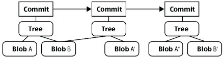
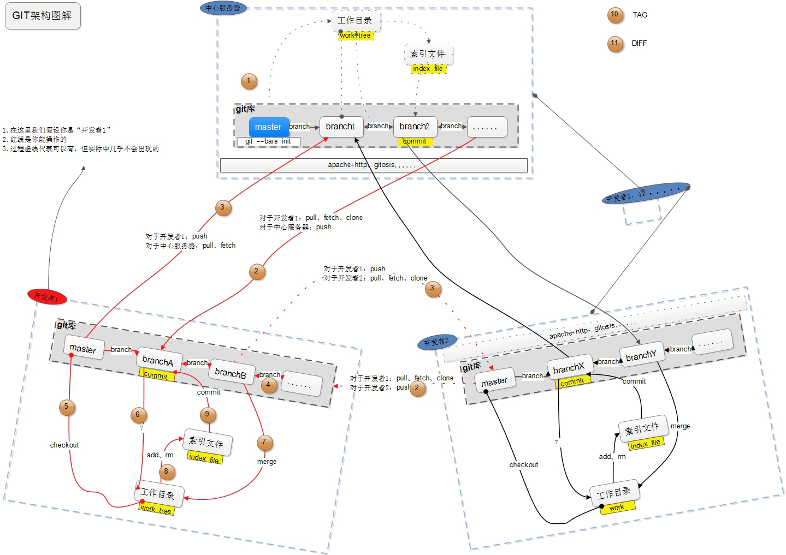

# Git学习笔记


## 仓库介绍

1. Git 基本使用及技巧总结
2. Git 思维导图

```
Something I hope you know before go into the coding~
First, please watch or star this repo, I'll be more happy if you follow me.
Bug report, questions and discussion are welcome, you can post an issue or pull a request.
```

## 相关站点

* Git Pro教程站点 : <https://git-scm.com/book/en/v2>
* GitBook : <https://yifengyou.gitbooks.io/learn-git/content/>
* GitHub : <https://github.com/yifengyou/learn-git/>
* GitPage : <https://yifengyou.github.io/learn-git/>


## Git 简介

**Git**(读音为**/gɪt/**)是一个开源的分布式版本控制系统，可以有效.高速的处理从很小到非常大的项目版本管理。

**Git 诞生于2005年，Linus Torvalds 为了帮助管理 Linux 内核开发花了两周时间自己用C写的一个分布式版本控制系统**


Torvalds 开始着手开发 **Git** 是为了作为一种过渡方案来替代 **BitKeeper**，后者之前一直是 Linux 内核开发人员在全球使用的主要源代码工具。开放源码社区中的有些人觉得BitKeeper 的许可证并不适合开放源码社区的工作，因此 Torvalds 决定着手研究许可证更为灵活的版本控制系统。尽管最初 Git 的开发是为了辅助 Linux 内核开发的过程，但是我们已经发现在很多其他自由软件项目中也使用了 Git。例如 很多 Freedesktop 的项目迁移到了 Git 上。

## GitHub 托管平台

GitHub是一个面向开源及私有软件项目的托管平台，因为只支持 Git 作为唯一的版本库格式进行托管，故名GitHub。

**GitHub于2008年4月10日正式上线**，除了 Git 代码仓库托管及基本的 Web 管理界面以外，还提供了**订阅、讨论组、文本渲染、在线文件编辑器、协作图谱（报表）、代码片段分享（Gist）**等功能。目前，其注册用户已经超过350万，托管版本数量也是非常之多，其中不乏知名开源项目 Ruby on Rails、jQuery、python 等。


* **章鱼猫**-GitHub吉祥物-<https://octodex.github.com/>

**2018年6月4日晚，微软宣布，通过75亿美元的股票交易收购代码托管平台 GitHub。**

## 目录

**图解Git操作**

* [图解Git操作](docs/图解Git操作.md)
    * [工作流程及原理](docs/图解Git操作/工作流程及原理.md)
    * [Git数据模型](docs/图解Git操作/Git数据模型.md)
    * [分离头指针](docs/图解Git操作/分离头指针.md)


**常用Git实例**

* [常用Git实例(Git Tips)](docs/常用Git实例.md)
    * [回到远程仓库的状态](docs/常用Git实例/回到远程仓库的状态.md)
    * [合并多个commit](docs/常用Git实例/合并多个commit.md)

**Git详解**

* [起步](docs/起步.md)
    * [关于版本控制](docs/起步/关于版本控制.md)
    * [Git简史](docs/起步/Git简史.md)
    * [Git基础](docs/起步/Git基础.md)
    * [命令行](docs/起步/命令行.md)
    * [安装Git](docs/起步/安装Git.md)
    * [初次运行Git前的配置](docs/起步/初次运行Git前的配置.md)
    * [获取帮助](docs/起步/获取帮助.md)
    * [总结](docs/起步/总结.md)
* [Git基础](docs/Git基础.md)
    * [获取Git仓库](docs/Git基础/获取Git仓库.md)
    * [记录每次更新到仓库](docs/Git基础/记录每次更新到仓库.md)
    * [查看提交历史](docs/Git基础/查看提交历史.md)
    * [撤销操作](docs/Git基础/撤销操作.md)
    * [远程仓库的使用](docs/Git基础/远程仓库的使用.md)
    * [查看提交历史](docs/Git基础/查看提交历史.md)
    * [撤销操作](docs/Git基础/撤销操作.md)
    * [远程仓库的使用](docs/Git基础/远程仓库的使用.md)
    * [tag打标签](docs/Git基础/tag打标签.md)
    * [Git别名](docs/Git基础/Git别名.md)
* [Git分支](docs/Git分支.md)
    * [分支简介](docs/Git分支/分支简介.md)
    * [分支的新建与合并](docs/Git分支/分支的新建与合并.md)
    * [分支管理](docs/Git分支/分支管理.md)
    * [分支开发工作流](docs/Git分支/分支开发工作流.md)
    * [远程分支](docs/Git分支/远程分支.md)
    * [变基](docs/Git分支/变基.md)
    * [总结](docs/Git分支/总结.md)
* [服务器上的Git](docs/服务器上的Git.md)
    * [协议](docs/服务器上的Git/协议.md)
    * [在服务器上搭建Git](docs/服务器上的Git/在服务器上搭建Git.md)
    * [生成SSH公钥](docs/服务器上的Git/生成SSH公钥.md)
    * [配置服务器](docs/服务器上的Git/配置服务器.md)
    * [Git守护进程](docs/服务器上的Git/Git守护进程.md)
    * [Smart HTTP](docs/服务器上的Git/SmartHTTP.md)
    * [GitWeb](docs/服务器上的Git/GitWeb.md)
    * [GitLab](docs/服务器上的Git/GitLab.md)
    * [第三方托管的选择](docs/服务器上的Git/第三方托管的选择.md)
    * [总结](docs/服务器上的Git/总结.md)
* [分布式Git](docs/分布式Git.md)
    * [分布式工作流程](docs/分布式Git/分布式工作流程.md)
    * [向一个项目贡献](docs/分布式Git/向一个项目贡献.md)
    * [维护项目](docs/分布式Git/维护项目.md)
    * [总结](docs/分布式Git/总结.md)
* [GitHub](docs/GitHub.md)
    * [账户的创建和配置](docs/GitHub/账户的创建和配置.md)
    * [对项目做出贡献](docs/GitHub/对项目做出贡献.md)
    * [维护项目](docs/GitHub/维护项目.md)
    * [管理组织](docs/GitHub/管理组织.md)
    * [脚本GitHub](docs/GitHub/脚本GitHub.md)
    * [总结](docs/GitHub/总结.md)
* [Git工具](docs/Git工具.md)
    * [选择修订版本](docs/Git工具/选择修订版本.md)
    * [交互式暂存](docs/Git工具/交互式暂存.md)
    * [储藏与清理](docs/Git工具/储藏与清理.md)
    * [签署工作](docs/Git工具/签署工作.md)
    * [搜索](docs/Git工具/搜索.md)
    * [重写历史](docs/Git工具/重写历史.md)
    * [重置揭密](docs/Git工具/重置揭密.md)
    * [高级合并](docs/Git工具/高级合并.md)
    * [Rerere](docs/Git工具/Rerere.md)
    * [使用Git调试](docs/Git工具/使用Git调试.md)
    * [子模块](docs/Git工具/子模块.md)
    * [打包](docs/Git工具/打包.md)
    * [替换](docs/Git工具/替换.md)
    * [凭证存储](docs/Git工具/凭证存储.md)
    * [总结](docs/Git工具/总结.md)
* [自定义Git](docs/自定义Git.md)
    * [配置Git](docs/自定义Git/配置Git.md)
    * [Git属性](docs/自定义Git/Git属性.md)
    * [Git钩子](docs/自定义Git/Git钩子.md)
    * [使用强制策略的一个例子](docs/自定义Git/使用强制策略的一个例子.md)
    * [总结](docs/自定义Git/总结.md)
* [Git与其他系统](docs/Git与其他系统.md)
    * [作为客户端的Git](docs/Git与其他系统/作为客户端的Git.md)
    * [迁移到Git](docs/Git与其他系统/迁移到Git.md)
    * [总结](docs/Git与其他系统/总结.md)
* [使用repo管理多个Git仓库](docs/使用repo管理多个Git仓库.md)
* [Git内部原理](docs/Git内部原理.md)
    * [底层命令和高层命令](docs/Git内部原理/底层命令和高层命令.md)
    * [Git对象](docs/Git内部原理/Git对象.md)
    * [Git引用](docs/Git内部原理/Git引用.md)
    * [包文件](docs/Git内部原理/包文件.md)
    * [引用规格](docs/Git内部原理/引用规格.md)
    * [传输协议](docs/Git内部原理/传输协议.md)
    * [维护与数据恢复](docs/Git内部原理/维护与数据恢复.md)
    * [环境变量](docs/Git内部原理/环境变量.md)
    * [总结](docs/Git内部原理/总结.md)
* [其它环境中的Git](docs/其它环境中的Git.md)
    * [图形界面](docs/其它环境中的Git/图形界面.md)
    * [VScode中的Git](docs/其它环境中的Git/VScode中的Git.md)
    * [Bash中的Git](docs/其它环境中的Git/Bash中的Git.md)
    * [Powershell中的Git](docs/其它环境中的Git/Powershell中的Git.md)
    * [总结](docs/其它环境中的Git/总结.md)
* [将Git嵌入你的应用](docs/将Git嵌入你的应用.md)
    * [命令行Git方式](docs/将Git嵌入你的应用/命令行Git方式.md)
    * [Libgit2](docs/将Git嵌入你的应用/Libgit2.md)
    * [JGit](docs/将Git嵌入你的应用/JGit.md)
* [附录-Git命令](docs/附录-Git命令.md)
    * [设置与配置](docs/附录-Git命令/设置与配置.md)
    * [获取与创建项目](docs/附录-Git命令/获取与创建项目.md)
    * [快照基础](docs/附录-Git命令/快照基础.md)
    * [分支与合并](docs/附录-Git命令/分支与合并.md)
    * [项目分享与更新](docs/附录-Git命令/项目分享与更新.md)
    * [检查与比较](docs/附录-Git命令/检查与比较.md)
    * [调试](docs/附录-Git命令/调试.md)
    * [补丁](docs/附录-Git命令/补丁.md)
    * [邮件](docs/附录-Git命令/邮件.md)
    * [外部系统](docs/附录-Git命令/外部系统.md)
    * [管理](docs/附录-Git命令/管理.md)
    * [底层命令](docs/附录-Git命令/底层命令.md)

## 参考

* <https://github.com/jackfrued/git-tips>

## 思维导图







## 总结

```
1. 如何学习神器，没啥特殊方法，经常用，多接触
2. 快速上手不可或缺思维导图
3. 不懂源码别说精通，顶多熟练~
```
