# v0.99Git源码分析-01

## v0.99源码获取

```
先从老版本源码看起，源码不在于新和旧，本质内容都一样，只不过新版本特性太多容易掩盖深层次本质内容
```


源码已经拷贝到本仓库src目录下

选择Git v0.99开始学习。从<https://github.com/git/git/tree/v0.99/>处下载源码，这个版本的Git非常简单，功能也很少，可以从中看到初期Git设计的初衷。


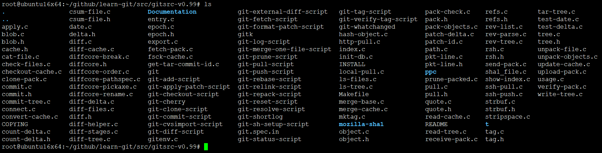


## v0.99源码编译

直接运行make，前提解决一些依赖libssl-dev、zlib

ubuntu16x64系统环境下执行

```
sudo apt-get install libssl-dev zlib1g-dev -y
```

```
  root@ubuntu16x64:~/github/learn-git/src/gitsrc-v0.99# make
  gcc -g -O2 -Wall '-DSHA1_HEADER=<openssl/sha.h>'   -c -o read-cache.o read-cache.c
  gcc -g -O2 -Wall '-DSHA1_HEADER=<openssl/sha.h>'   -c -o sha1_file.o sha1_file.c
  sha1_file.c: In function ‘packed_object_info_detail’:
  sha1_file.c:721:24: warning: variable ‘left’ set but not used [-Wunused-but-set-variable]
    unsigned long offset, left;
                          ^
  sha1_file.c: In function ‘write_sha1_from_fd’:
  sha1_file.c:1307:3: warning: ignoring return value of ‘write’, declared with attribute warn_unused_result [-Wunused-result]
     write(local, buf, size);
     ^
  gcc -g -O2 -Wall '-DSHA1_HEADER=<openssl/sha.h>'   -c -o usage.o usage.c
  gcc -g -O2 -Wall '-DSHA1_HEADER=<openssl/sha.h>'   -c -o object.o object.c
  gcc -g -O2 -Wall '-DSHA1_HEADER=<openssl/sha.h>'   -c -o commit.o commit.c
  gcc -g -O2 -Wall '-DSHA1_HEADER=<openssl/sha.h>'   -c -o tree.o tree.c
  gcc -g -O2 -Wall '-DSHA1_HEADER=<openssl/sha.h>'   -c -o blob.o blob.c
  gcc -g -O2 -Wall '-DSHA1_HEADER=<openssl/sha.h>'   -c -o tag.o tag.c
  gcc -g -O2 -Wall '-DSHA1_HEADER=<openssl/sha.h>'   -c -o date.o date.c
  gcc -g -O2 -Wall '-DSHA1_HEADER=<openssl/sha.h>'   -c -o index.o index.c
  gcc -g -O2 -Wall '-DSHA1_HEADER=<openssl/sha.h>'   -c -o diff-delta.o diff-delta.c
  gcc -g -O2 -Wall '-DSHA1_HEADER=<openssl/sha.h>'   -c -o patch-delta.o patch-delta.c
  gcc -g -O2 -Wall '-DSHA1_HEADER=<openssl/sha.h>'   -c -o entry.o entry.c
  gcc -g -O2 -Wall '-DSHA1_HEADER=<openssl/sha.h>'   -c -o path.o path.c
  gcc -g -O2 -Wall '-DSHA1_HEADER=<openssl/sha.h>'   -c -o epoch.o epoch.c
  gcc -g -O2 -Wall '-DSHA1_HEADER=<openssl/sha.h>'   -c -o refs.o refs.c
  gcc -g -O2 -Wall '-DSHA1_HEADER=<openssl/sha.h>'   -c -o csum-file.o csum-file.c
  gcc -g -O2 -Wall '-DSHA1_HEADER=<openssl/sha.h>'   -c -o pack-check.o pack-check.c
  gcc -g -O2 -Wall '-DSHA1_HEADER=<openssl/sha.h>'   -c -o pkt-line.o pkt-line.c
  gcc -g -O2 -Wall '-DSHA1_HEADER=<openssl/sha.h>'   -c -o connect.o connect.c
  gcc -g -O2 -Wall '-DSHA1_HEADER=<openssl/sha.h>'   -c -o strbuf.o strbuf.c
  gcc -g -O2 -Wall '-DSHA1_HEADER=<openssl/sha.h>'   -c -o quote.o quote.c
  gcc -g -O2 -Wall '-DSHA1_HEADER=<openssl/sha.h>'   -c -o diff.o diff.c
  diff.c: In function ‘parse_num’:
  diff.c:702:3: warning: value computed is not used [-Wunused-value]
     *cp++;
     ^
  gcc -g -O2 -Wall '-DSHA1_HEADER=<openssl/sha.h>'   -c -o diffcore-rename.o diffcore-rename.c
  gcc -g -O2 -Wall '-DSHA1_HEADER=<openssl/sha.h>'   -c -o diffcore-pickaxe.o diffcore-pickaxe.c
  gcc -g -O2 -Wall '-DSHA1_HEADER=<openssl/sha.h>'   -c -o diffcore-pathspec.o diffcore-pathspec.c
  gcc -g -O2 -Wall '-DSHA1_HEADER=<openssl/sha.h>'   -c -o count-delta.o count-delta.c
  count-delta.c: In function ‘count_delta’:
  count-delta.c:31:16: warning: variable ‘src_size’ set but not used [-Wunused-but-set-variable]
    unsigned long src_size, dst_size, out;
                  ^
  gcc -g -O2 -Wall '-DSHA1_HEADER=<openssl/sha.h>'   -c -o diffcore-break.o diffcore-break.c
  gcc -g -O2 -Wall '-DSHA1_HEADER=<openssl/sha.h>'   -c -o diffcore-order.o diffcore-order.c
  gcc -g -O2 -Wall '-DSHA1_HEADER=<openssl/sha.h>'   -c -o gitenv.o gitenv.c
  ar rcs libgit.a read-cache.o sha1_file.o usage.o object.o commit.o tree.o blob.o tag.o date.o index.o diff-delta.o patch-delta.o entry.o path.o epoch.o refs.o csum-file.o pack-check.o pkt-line.o connect.o strbuf.o quote.o  diff.o diffcore-rename.o diffcore-pickaxe.o diffcore-pathspec.o count-delta.o diffcore-break.o diffcore-order.o gitenv.o
  gcc -g -O2 -Wall '-DSHA1_HEADER=<openssl/sha.h>' -o git-update-cache update-cache.c libgit.a -lz -lcrypto
  gcc -g -O2 -Wall '-DSHA1_HEADER=<openssl/sha.h>' -o git-diff-files diff-files.c libgit.a -lz -lcrypto
  gcc -g -O2 -Wall '-DSHA1_HEADER=<openssl/sha.h>' -o git-init-db init-db.c libgit.a -lz -lcrypto
  gcc -g -O2 -Wall '-DSHA1_HEADER=<openssl/sha.h>' -o git-write-tree write-tree.c libgit.a -lz -lcrypto
  gcc -g -O2 -Wall '-DSHA1_HEADER=<openssl/sha.h>' -o git-read-tree read-tree.c libgit.a -lz -lcrypto
  read-tree.c: In function ‘main’:
  read-tree.c:519:23: warning: variable ‘reset’ set but not used [-Wunused-but-set-variable]
    int i, newfd, merge, reset, emu23;
                         ^
  gcc -g -O2 -Wall '-DSHA1_HEADER=<openssl/sha.h>' -o git-commit-tree commit-tree.c libgit.a -lz -lcrypto
  commit-tree.c: In function ‘main’:
  commit-tree.c:155:3: warning: ignoring return value of ‘getdomainname’, declared with attribute warn_unused_result [-Wunused-result]
     getdomainname(realemail+strlen(realemail), sizeof(realemail)-strlen(realemail)-1);
     ^
  gcc -g -O2 -Wall '-DSHA1_HEADER=<openssl/sha.h>' -o git-cat-file cat-file.c libgit.a -lz -lcrypto
  gcc -g -O2 -Wall '-DSHA1_HEADER=<openssl/sha.h>' -o git-fsck-cache fsck-cache.c libgit.a -lz -lcrypto
  gcc -g -O2 -Wall '-DSHA1_HEADER=<openssl/sha.h>' -o git-checkout-cache checkout-cache.c libgit.a -lz -lcrypto
  gcc -g -O2 -Wall '-DSHA1_HEADER=<openssl/sha.h>' -o git-diff-tree diff-tree.c libgit.a -lz -lcrypto
  gcc -g -O2 -Wall '-DSHA1_HEADER=<openssl/sha.h>' -o git-rev-tree rev-tree.c libgit.a -lz -lcrypto
  gcc -g -O2 -Wall '-DSHA1_HEADER=<openssl/sha.h>' -o git-ls-files ls-files.c libgit.a -lz -lcrypto
  gcc -g -O2 -Wall '-DSHA1_HEADER=<openssl/sha.h>' -o git-check-files check-files.c libgit.a -lz -lcrypto
  gcc -g -O2 -Wall '-DSHA1_HEADER=<openssl/sha.h>' -o git-ls-tree ls-tree.c libgit.a -lz -lcrypto
  gcc -g -O2 -Wall '-DSHA1_HEADER=<openssl/sha.h>' -o git-merge-base merge-base.c libgit.a -lz -lcrypto
  gcc -g -O2 -Wall '-DSHA1_HEADER=<openssl/sha.h>' -o git-merge-cache merge-cache.c libgit.a -lz -lcrypto
  gcc -g -O2 -Wall '-DSHA1_HEADER=<openssl/sha.h>' -o git-unpack-file unpack-file.c libgit.a -lz -lcrypto
  gcc -g -O2 -Wall '-DSHA1_HEADER=<openssl/sha.h>' -o git-export export.c libgit.a -lz -lcrypto
  export.c: In function ‘show_commit’:
  export.c:16:2: warning: ignoring return value of ‘system’, declared with attribute warn_unused_result [-Wunused-result]
    system(cmdline);
    ^
  export.c:22:3: warning: ignoring return value of ‘system’, declared with attribute warn_unused_result [-Wunused-result]
     system(cmdline);
     ^
  gcc -g -O2 -Wall '-DSHA1_HEADER=<openssl/sha.h>' -o git-diff-cache diff-cache.c libgit.a -lz -lcrypto
  gcc -g -O2 -Wall '-DSHA1_HEADER=<openssl/sha.h>' -o git-convert-cache convert-cache.c libgit.a -lz -lcrypto
  gcc -g -O2 -Wall '-DSHA1_HEADER=<openssl/sha.h>' -o git-http-pull http-pull.c pull.c libgit.a -lz -lcrypto -lcurl
  gcc -g -O2 -Wall '-DSHA1_HEADER=<openssl/sha.h>' -o git-ssh-push ssh-push.c rsh.c libgit.a -lz -lcrypto
  ssh-push.c: In function ‘serve_version’:
  ssh-push.c:51:2: warning: ignoring return value of ‘write’, declared with attribute warn_unused_result [-Wunused-result]
    write(fd_out, &local_version, 1);
    ^
  ssh-push.c: In function ‘serve_object’:
  ssh-push.c:39:2: warning: ignoring return value of ‘write’, declared with attribute warn_unused_result [-Wunused-result]
    write(fd_out, &remote, 1);
    ^
  ssh-push.c: In function ‘serve_ref’:
  ssh-push.c:72:2: warning: ignoring return value of ‘write’, declared with attribute warn_unused_result [-Wunused-result]
    write(fd_out, &remote, 1);
    ^
  ssh-push.c:75:2: warning: ignoring return value of ‘write’, declared with attribute warn_unused_result [-Wunused-result]
    write(fd_out, sha1, 20);
    ^
  gcc -g -O2 -Wall '-DSHA1_HEADER=<openssl/sha.h>' -o git-ssh-pull ssh-pull.c rsh.c pull.c libgit.a -lz -lcrypto
  ssh-pull.c: In function ‘fetch’:
  ssh-pull.c:20:2: warning: ignoring return value of ‘write’, declared with attribute warn_unused_result [-Wunused-result]
    write(fd_out, &type, 1);
    ^
  ssh-pull.c:21:2: warning: ignoring return value of ‘write’, declared with attribute warn_unused_result [-Wunused-result]
    write(fd_out, sha1, 20);
    ^
  ssh-pull.c: In function ‘fetch_ref’:
  ssh-pull.c:47:2: warning: ignoring return value of ‘write’, declared with attribute warn_unused_result [-Wunused-result]
    write(fd_out, &type, 1);
    ^
  ssh-pull.c:48:2: warning: ignoring return value of ‘write’, declared with attribute warn_unused_result [-Wunused-result]
    write(fd_out, ref, strlen(ref) + 1);
    ^
  ssh-pull.c:49:2: warning: ignoring return value of ‘read’, declared with attribute warn_unused_result [-Wunused-result]
    read(fd_in, &remote, 1);
    ^
  ssh-pull.c:52:2: warning: ignoring return value of ‘read’, declared with attribute warn_unused_result [-Wunused-result]
    read(fd_in, sha1, 20);
    ^
  ssh-pull.c: In function ‘get_version’:
  ssh-pull.c:35:2: warning: ignoring return value of ‘write’, declared with attribute warn_unused_result [-Wunused-result]
    write(fd_out, &type, 1);
    ^
  ssh-pull.c:36:2: warning: ignoring return value of ‘write’, declared with attribute warn_unused_result [-Wunused-result]
    write(fd_out, &local_version, 1);
    ^
  gcc -g -O2 -Wall '-DSHA1_HEADER=<openssl/sha.h>' -o git-rev-list rev-list.c libgit.a -lz -lcrypto -lssl
  gcc -g -O2 -Wall '-DSHA1_HEADER=<openssl/sha.h>' -o git-mktag mktag.c libgit.a -lz -lcrypto
  gcc -g -O2 -Wall '-DSHA1_HEADER=<openssl/sha.h>' -o git-diff-helper diff-helper.c libgit.a -lz -lcrypto
  gcc -g -O2 -Wall '-DSHA1_HEADER=<openssl/sha.h>' -o git-tar-tree tar-tree.c libgit.a -lz -lcrypto
  gcc -g -O2 -Wall '-DSHA1_HEADER=<openssl/sha.h>' -o git-local-pull local-pull.c pull.c libgit.a -lz -lcrypto
  gcc -g -O2 -Wall '-DSHA1_HEADER=<openssl/sha.h>' -o git-hash-object hash-object.c libgit.a -lz -lcrypto
  gcc -g -O2 -Wall '-DSHA1_HEADER=<openssl/sha.h>' -o git-get-tar-commit-id get-tar-commit-id.c libgit.a -lz -lcrypto
  gcc -g -O2 -Wall '-DSHA1_HEADER=<openssl/sha.h>' -o git-apply apply.c libgit.a -lz -lcrypto
  apply.c: In function ‘show_rename_copy’:
  apply.c:1145:10: warning: field precision specifier ‘.*’ expects argument of type ‘int’, but argument 3 has type ‘long int’ [-Wformat=]
     printf(" %s %.*s{%s => %s} (%d%%)\n", renamecopy,
            ^
  gcc -g -O2 -Wall '-DSHA1_HEADER=<openssl/sha.h>' -o git-stripspace stripspace.c libgit.a -lz -lcrypto
  gcc -g -O2 -Wall '-DSHA1_HEADER=<openssl/sha.h>' -o git-diff-stages diff-stages.c libgit.a -lz -lcrypto
  gcc -g -O2 -Wall '-DSHA1_HEADER=<openssl/sha.h>' -o git-rev-parse rev-parse.c libgit.a -lz -lcrypto
  gcc -g -O2 -Wall '-DSHA1_HEADER=<openssl/sha.h>' -o git-patch-id patch-id.c libgit.a -lz -lcrypto
  gcc -g -O2 -Wall '-DSHA1_HEADER=<openssl/sha.h>' -o git-pack-objects pack-objects.c libgit.a -lz -lcrypto
  pack-objects.c: In function ‘write_pack_file’:
  pack-objects.c:133:16: warning: variable ‘mb’ set but not used [-Wunused-but-set-variable]
    unsigned long mb;
                  ^
  gcc -g -O2 -Wall '-DSHA1_HEADER=<openssl/sha.h>' -o git-unpack-objects unpack-objects.c libgit.a -lz -lcrypto
  gcc -g -O2 -Wall '-DSHA1_HEADER=<openssl/sha.h>' -o git-verify-pack verify-pack.c libgit.a -lz -lcrypto
  gcc -g -O2 -Wall '-DSHA1_HEADER=<openssl/sha.h>' -o git-receive-pack receive-pack.c libgit.a -lz -lcrypto
  receive-pack.c: In function ‘main’:
  receive-pack.c:205:2: warning: ignoring return value of ‘chdir’, declared with attribute warn_unused_result [-Wunused-result]
    chdir(".git");
    ^
  gcc -g -O2 -Wall '-DSHA1_HEADER=<openssl/sha.h>' -o git-send-pack send-pack.c libgit.a -lz -lcrypto
  send-pack.c: In function ‘send_pack’:
  send-pack.c:172:9: warning: variable ‘name’ set but not used [-Wunused-but-set-variable]
     char *name;
           ^
  gcc -g -O2 -Wall '-DSHA1_HEADER=<openssl/sha.h>' -o git-prune-packed prune-packed.c libgit.a -lz -lcrypto
  gcc -g -O2 -Wall '-DSHA1_HEADER=<openssl/sha.h>' -o git-fetch-pack fetch-pack.c libgit.a -lz -lcrypto
  gcc -g -O2 -Wall '-DSHA1_HEADER=<openssl/sha.h>' -o git-upload-pack upload-pack.c libgit.a -lz -lcrypto
  upload-pack.c: In function ‘main’:
  upload-pack.c:179:2: warning: ignoring return value of ‘chdir’, declared with attribute warn_unused_result [-Wunused-result]
    chdir(".git");
    ^
  gcc -g -O2 -Wall '-DSHA1_HEADER=<openssl/sha.h>' -o git-clone-pack clone-pack.c libgit.a -lz -lcrypto
  gcc -g -O2 -Wall '-DSHA1_HEADER=<openssl/sha.h>' -o git-show-index show-index.c libgit.a -lz -lcrypto
```

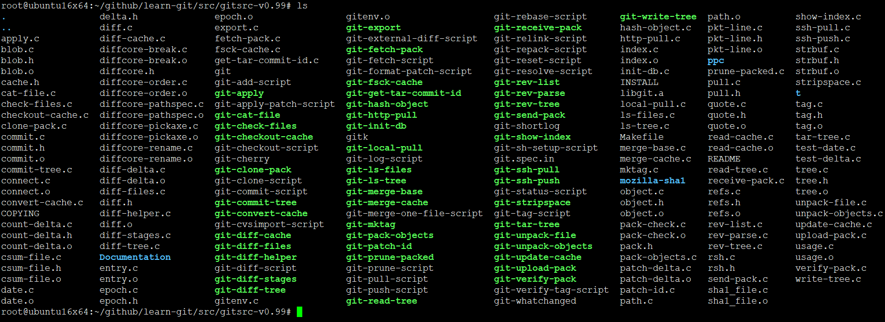

## Makefile文件

```
  # -DCOLLISION_CHECK if you believe that SHA1's
  # 1461501637330902918203684832716283019655932542976 hashes do not give you
  # enough guarantees about no collisions between objects ever hapenning.
  #
  # -DUSE_NSEC if you want git to care about sub-second file mtimes and ctimes.
  # -DUSE_STDEV if you want git to care about st_dev changing
  #
  # Note that you need some new glibc (at least >2.2.4) for this, and it will
  # BREAK YOUR LOCAL DIFFS! show-diff and anything using it will likely randomly
  # break unless your underlying filesystem supports those sub-second times
  # (my ext3 doesn't).
  GIT_VERSION=0.99

  COPTS=-O2
  CFLAGS=-g $(COPTS) -Wall

  prefix=$(HOME)
  bin=$(prefix)/bin
  # dest=

  CC=gcc
  AR=ar
  INSTALL=install

  #
  # sparse is architecture-neutral, which means that we need to tell it
  # explicitly what architecture to check for. Fix this up for yours..
  #
  SPARSE_FLAGS=-D__BIG_ENDIAN__ -D__powerpc__

  SCRIPTS=git git-apply-patch-script git-merge-one-file-script git-prune-script \
  	git-pull-script git-tag-script git-resolve-script git-whatchanged \
  	git-fetch-script git-status-script git-commit-script \
  	git-log-script git-shortlog git-cvsimport-script git-diff-script \
  	git-reset-script git-add-script git-checkout-script git-clone-script \
  	gitk git-cherry git-rebase-script git-relink-script git-repack-script \
  	git-format-patch-script git-sh-setup-script git-push-script

  PROG=   git-update-cache git-diff-files git-init-db git-write-tree \
  	git-read-tree git-commit-tree git-cat-file git-fsck-cache \
  	git-checkout-cache git-diff-tree git-rev-tree git-ls-files \
  	git-check-files git-ls-tree git-merge-base git-merge-cache \
  	git-unpack-file git-export git-diff-cache git-convert-cache \
  	git-http-pull git-ssh-push git-ssh-pull git-rev-list git-mktag \
  	git-diff-helper git-tar-tree git-local-pull git-hash-object \
  	git-get-tar-commit-id git-apply git-stripspace \
  	git-diff-stages git-rev-parse git-patch-id git-pack-objects \
  	git-unpack-objects git-verify-pack git-receive-pack git-send-pack \
  	git-prune-packed git-fetch-pack git-upload-pack git-clone-pack \
  	git-show-index

  all: $(PROG)

  install: $(PROG) $(SCRIPTS)
  	$(INSTALL) -m755 -d $(dest)$(bin)
  	$(INSTALL) $(PROG) $(SCRIPTS) $(dest)$(bin)

  LIB_OBJS=read-cache.o sha1_file.o usage.o object.o commit.o tree.o blob.o \
  	 tag.o date.o index.o diff-delta.o patch-delta.o entry.o path.o \
  	 epoch.o refs.o csum-file.o pack-check.o pkt-line.o connect.o
  LIB_FILE=libgit.a
  LIB_H=cache.h object.h blob.h tree.h commit.h tag.h delta.h epoch.h csum-file.h \
  	pack.h pkt-line.h refs.h

  LIB_H += strbuf.h
  LIB_OBJS += strbuf.o

  LIB_H += quote.h
  LIB_OBJS += quote.o

  LIB_H += diff.h count-delta.h
  LIB_OBJS += diff.o diffcore-rename.o diffcore-pickaxe.o diffcore-pathspec.o \
  	count-delta.o diffcore-break.o diffcore-order.o

  LIB_OBJS += gitenv.o

  LIBS = $(LIB_FILE)
  LIBS += -lz

  ifdef MOZILLA_SHA1
    SHA1_HEADER="mozilla-sha1/sha1.h"
    LIB_OBJS += mozilla-sha1/sha1.o
  else
  ifdef PPC_SHA1
    SHA1_HEADER="ppc/sha1.h"
    LIB_OBJS += ppc/sha1.o ppc/sha1ppc.o
  else
    SHA1_HEADER=<openssl/sha.h>
    LIBS += -lcrypto
  endif
  endif

  CFLAGS += '-DSHA1_HEADER=$(SHA1_HEADER)'

  $(LIB_FILE): $(LIB_OBJS)
  	$(AR) rcs $@ $(LIB_OBJS)

  check:
  	for i in *.c; do sparse $(CFLAGS) $(SPARSE_FLAGS) $$i; done

  test-date: test-date.c date.o
  	$(CC) $(CFLAGS) -o $@ test-date.c date.o

  test-delta: test-delta.c diff-delta.o patch-delta.o
  	$(CC) $(CFLAGS) -o $@ $^

  git-%: %.c $(LIB_FILE)
  	$(CC) $(CFLAGS) -o $@ $(filter %.c,$^) $(LIBS)

  git-update-cache: update-cache.c
  git-diff-files: diff-files.c
  git-init-db: init-db.c
  git-write-tree: write-tree.c
  git-read-tree: read-tree.c
  git-commit-tree: commit-tree.c
  git-cat-file: cat-file.c
  git-fsck-cache: fsck-cache.c
  git-checkout-cache: checkout-cache.c
  git-diff-tree: diff-tree.c
  git-rev-tree: rev-tree.c
  git-ls-files: ls-files.c
  git-check-files: check-files.c
  git-ls-tree: ls-tree.c
  git-merge-base: merge-base.c
  git-merge-cache: merge-cache.c
  git-unpack-file: unpack-file.c
  git-export: export.c
  git-diff-cache: diff-cache.c
  git-convert-cache: convert-cache.c
  git-http-pull: http-pull.c pull.c
  git-local-pull: local-pull.c pull.c
  git-ssh-push: rsh.c
  git-ssh-pull: rsh.c pull.c
  git-rev-list: rev-list.c
  git-mktag: mktag.c
  git-diff-helper: diff-helper.c
  git-tar-tree: tar-tree.c
  git-hash-object: hash-object.c
  git-stripspace: stripspace.c
  git-diff-stages: diff-stages.c
  git-rev-parse: rev-parse.c
  git-patch-id: patch-id.c
  git-pack-objects: pack-objects.c
  git-unpack-objects: unpack-objects.c
  git-verify-pack: verify-pack.c
  git-receive-pack: receive-pack.c
  git-send-pack: send-pack.c
  git-prune-packed: prune-packed.c
  git-fetch-pack: fetch-pack.c

  git-http-pull: LIBS += -lcurl
  git-rev-list: LIBS += -lssl

  # Library objects..
  blob.o: $(LIB_H)
  tree.o: $(LIB_H)
  commit.o: $(LIB_H)
  tag.o: $(LIB_H)
  object.o: $(LIB_H)
  read-cache.o: $(LIB_H)
  sha1_file.o: $(LIB_H)
  usage.o: $(LIB_H)
  strbuf.o: $(LIB_H)
  gitenv.o: $(LIB_H)
  entry.o: $(LIB_H)
  diff.o: $(LIB_H) diffcore.h
  diffcore-rename.o : $(LIB_H) diffcore.h
  diffcore-pathspec.o : $(LIB_H) diffcore.h
  diffcore-pickaxe.o : $(LIB_H) diffcore.h
  diffcore-break.o : $(LIB_H) diffcore.h
  diffcore-order.o : $(LIB_H) diffcore.h
  epoch.o: $(LIB_H)

  git.spec: git.spec.in
  	sed -e 's/@@VERSION@@/$(GIT_VERSION)/g' < $< > $@

  GIT_TARNAME=git-$(GIT_VERSION)
  dist: git.spec
  	git-tar-tree HEAD $(GIT_TARNAME) > $(GIT_TARNAME).tar
  	@mkdir -p $(GIT_TARNAME)
  	@cp git.spec $(GIT_TARNAME)
  	tar rf $(GIT_TARNAME).tar $(GIT_TARNAME)/git.spec
  	@rm -rf $(GIT_TARNAME)
  	gzip -9 $(GIT_TARNAME).tar

  rpm: dist
  	rpmbuild -ta git-$(GIT_VERSION).tar.gz

  test: all
  	$(MAKE) -C t/ all

  clean:
  	rm -f *.o mozilla-sha1/*.o ppc/*.o $(PROG) $(LIB_FILE)
  	$(MAKE) -C Documentation/ clean

  backup: clean
  	cd .. ; tar czvf dircache.tar.gz dir-cache
```


Makefile中几个典型目标，默认all目标，clean目标，install目标


install目标，需要指定安装目录，传递给$HOME变量就可以了

```
root@ubuntu16x64:~/github/learn-git/src/gitsrc-v0.99/bin# make install HOME=`pwd`
```
这里把HOME指定为当前目录，酱紫不会破坏本机git环境。

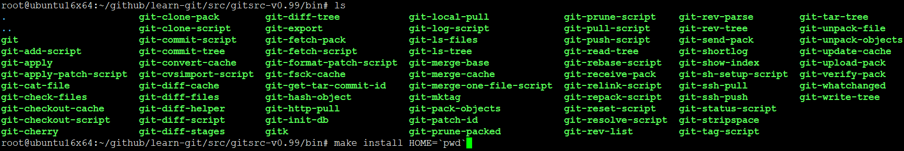

这里就是所有可执行程序，不管是脚本还是二进制程序

```
root@ubuntu16x64:~/github/learn-git/src/gitsrc-v0.99/bin# file * | grep ELF | cut -d ' ' -f 1
git-apply:
git-cat-file:
git-check-files:
git-checkout-cache:
git-clone-pack:
git-commit-tree:
git-convert-cache:
git-diff-cache:
git-diff-files:
git-diff-helper:
git-diff-stages:
git-diff-tree:
git-export:
git-fetch-pack:
git-fsck-cache:
git-get-tar-commit-id:
git-hash-object:
git-http-pull:
git-init-db:
git-local-pull:
git-ls-files:
git-ls-tree:
git-merge-base:
git-merge-cache:
git-mktag:
git-pack-objects:
git-patch-id:
git-prune-packed:
git-read-tree:
git-receive-pack:
git-rev-list:
git-rev-parse:
git-rev-tree:
git-send-pack:
git-show-index:
git-ssh-pull:
git-ssh-push:
git-stripspace:
git-tar-tree:
git-unpack-file:
git-unpack-objects:
git-update-cache:
git-upload-pack:
git-verify-pack:
git-write-tree:
```

## bash环境造成错误问题解决


直接运行git会发现报错，因为默认ubuntu中的sh是连接到dash中的，很明显git对dash不友好，需要请出老盆友bash来支援，如果修改每个脚本中的开头```#!/bin/sh```就太麻烦了，直接把/bin/sh软链接改成连接到bash就可以了

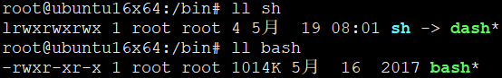

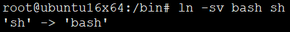

然后就可以正常运行了

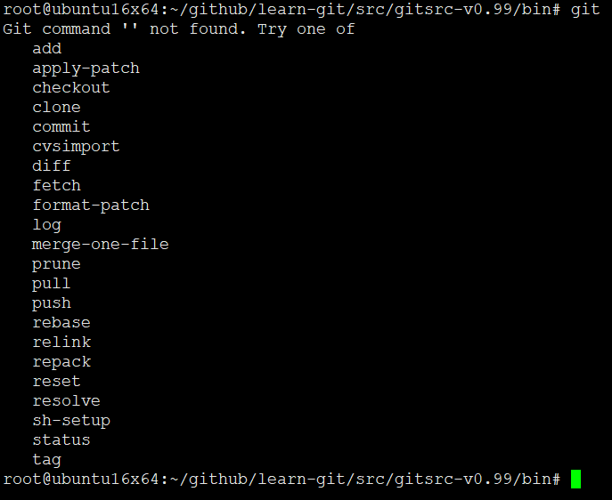

这个版本git很精简，连版本查看都莫有，至少我还没看到


## 整体观


生成的git和gitk都是脚本，整个git大功能被分成各个ELF子模块来实现，.git目录就是操作对象，本质上操作对象包括元数据和数据。这些都被称作对象。明白git中对象模型，基本理解一般，理解git中的有向无环图理解了另一半，剩下的基本细枝末节，就连特么的超级重要的分支合并其实都是这些的一个应用，只是这个应用非常重要。

git对象模型

* blob对象： “blob”用来存储文件数据，通常是一个文件。
* tree对象： “tree”有点像一个目录，它管理一些“tree”或是 “blob”（就像文件和子目录）
* commit对象： 一个“commit”只指向一个"tree"，它用来标记项目某一个特定时间点的状态。它包括一些关于时间点的元数据，如时间戳、最近一次提交的作者、指向上次提交（commits）的指针等等。
* tag对象： 一个“tag”是来标记某一个提交(commit) 。

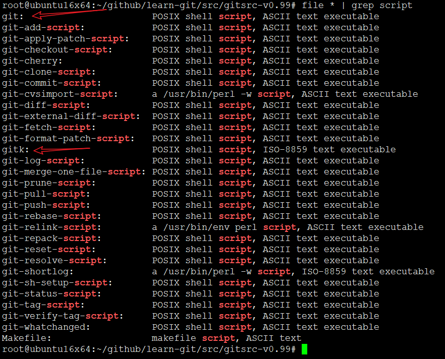

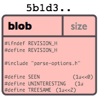

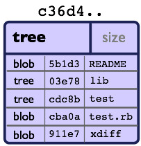


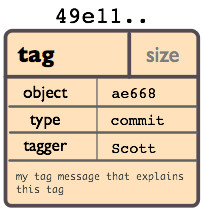


## git脚本文件

首先你必须知道git是多个功能模块的组合，git命令包含超级多的子命令，那么如果命令非常多你会怎么处理？

软件设计原理也是讲的头头是道，但是真正应用的其实很简单就能办到

git就是结合了脚本和elf程序，将脚本作为入口，执行对应的elf模块，典型的分模块的设计思想

git脚本是所有程序的入口，虽然你也可以直接运行对应的脚本或elf程序，但一般作为入口的也就git了。

git入口通过命令行参数，诸如

```
git add README.md
```

git是脚本，脚本中将add作为跳板找到下一个脚本入口

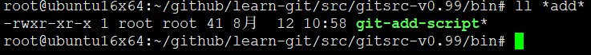

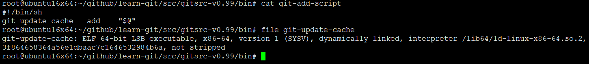

然后脚本最终具体实现还是调用二进制程序。

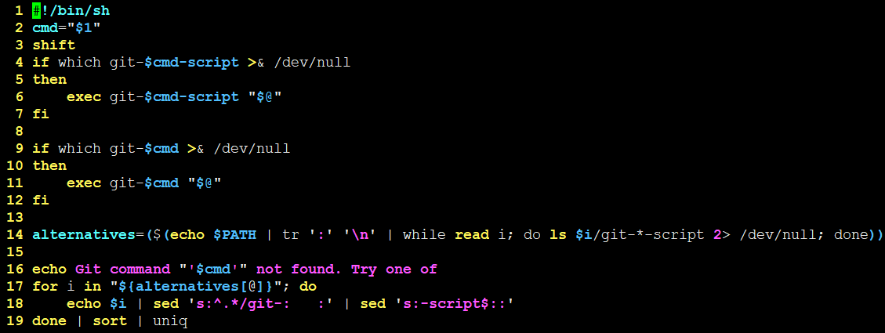

这个脚本文件是所有git子命令的入口

```
  #!/bin/bash
  cmd="$1"
  shift     #移除一个参数，例如 git add README.md，移除参数add，add命令存放在cmd
  if which git-$cmd-script >& /dev/null
  then
  	exec git-$cmd-script "$@"
  fi
  # 这里分界，根据命令调用对应的脚本或者二进制程序，脚本有脚本的用法，二进制有二进制用法
  # 无非都是开辟一个子进程执行
  if which git-$cmd >& /dev/null
  then
  	exec git-$cmd "$@"
  fi

  # 从PATH环境变量中找git-*-script匹配的赋值给alternatives
  alternatives=($(echo $PATH | tr ':' '\n' | while read i; do ls $i/git-*-script 2> /dev/null; done))

  echo Git command "'$cmd'" not found. Try one of
  for i in "${alternatives[@]}"; do
  	echo $i | sed 's:^.*/git-:   :' | sed 's:-script$::'
  done | sort | uniq
```

包括git和gitk在内，所有以git-*-script匹配的都是脚本

```
  root@ubuntu16x64:~/github/learn-git/src/gitsrc-v0.99/bin# ll *script
  -rwxr-xr-x 1 root root   41 8月  12 10:58 git-add-script*
  -rwxr-xr-x 1 root root 3.3K 8月  12 10:58 git-apply-patch-script*
  -rwxr-xr-x 1 root root  991 8月  12 10:58 git-checkout-script*
  -rwxr-xr-x 1 root root 1.9K 8月  12 10:58 git-clone-script*
  -rwxr-xr-x 1 root root 2.1K 8月  12 10:58 git-commit-script*
  -rwxr-xr-x 1 root root  19K 8月  12 10:58 git-cvsimport-script*
  -rwxr-xr-x 1 root root  387 8月  12 10:58 git-diff-script*
  -rwxr-xr-x 1 root root  774 8月  12 10:58 git-fetch-script*
  -rwxr-xr-x 1 root root 2.9K 8月  12 10:58 git-format-patch-script*
  -rwxr-xr-x 1 root root  143 8月  12 10:58 git-log-script*
  -rwxr-xr-x 1 root root 1.9K 8月  12 10:58 git-merge-one-file-script*
  -rwxr-xr-x 1 root root  471 8月  12 10:58 git-prune-script*
  -rwxr-xr-x 1 root root  454 8月  12 10:58 git-pull-script*
  -rwxr-xr-x 1 root root   78 8月  12 10:58 git-push-script*
  -rwxr-xr-x 1 root root  942 8月  12 10:58 git-rebase-script*
  -rwxr-xr-x 1 root root 4.1K 8月  12 10:58 git-relink-script*
  -rwxr-xr-x 1 root root  477 8月  12 10:58 git-repack-script*
  -rwxr-xr-x 1 root root  141 8月  12 10:58 git-reset-script*
  -rwxr-xr-x 1 root root 1.7K 8月  12 10:58 git-resolve-script*
  -rwxr-xr-x 1 root root  307 8月  12 10:58 git-sh-setup-script*
  -rwxr-xr-x 1 root root  868 8月  12 10:58 git-status-script*
  -rwxr-xr-x 1 root root  641 8月  12 10:58 git-tag-script*
  root@ubuntu16x64:~/github/learn-git/src/gitsrc-v0.99/bin#
```

```
  root@ubuntu16x64:~/github/learn-git/src/gitsrc-v0.99/bin# ll git-*|grep -v script
  -rwxr-xr-x 1 root root 226K 8月  12 10:58 git-apply*
  -rwxr-xr-x 1 root root 123K 8月  12 10:58 git-cat-file*
  -rwxr-xr-x 1 root root 151K 8月  12 10:58 git-check-files*
  -rwxr-xr-x 1 root root 173K 8月  12 10:58 git-checkout-cache*
  -rwxr-xr-x 1 root root 1.7K 8月  12 10:58 git-cherry*
  -rwxr-xr-x 1 root root 149K 8月  12 10:58 git-clone-pack*
  -rwxr-xr-x 1 root root 155K 8月  12 10:58 git-commit-tree*
  -rwxr-xr-x 1 root root 142K 8月  12 10:58 git-convert-cache*
  -rwxr-xr-x 1 root root 372K 8月  12 10:58 git-diff-cache*
  -rwxr-xr-x 1 root root 283K 8月  12 10:58 git-diff-files*
  -rwxr-xr-x 1 root root 285K 8月  12 10:58 git-diff-helper*
  -rwxr-xr-x 1 root root 282K 8月  12 10:58 git-diff-stages*
  -rwxr-xr-x 1 root root 389K 8月  12 10:58 git-diff-tree*
  -rwxr-xr-x 1 root root 237K 8月  12 10:58 git-export*
  -rwxr-xr-x 1 root root 147K 8月  12 10:58 git-fetch-pack*
  -rwxr-xr-x 1 root root 283K 8月  12 10:58 git-fsck-cache*
  -rwxr-xr-x 1 root root  13K 8月  12 10:58 git-get-tar-commit-id*
  -rwxr-xr-x 1 root root 124K 8月  12 10:58 git-hash-object*
  -rwxr-xr-x 1 root root 277K 8月  12 10:58 git-http-pull*
  -rwxr-xr-x 1 root root 126K 8月  12 10:58 git-init-db*
  -rwxr-xr-x 1 root root 268K 8月  12 10:58 git-local-pull*
  -rwxr-xr-x 1 root root 174K 8月  12 10:58 git-ls-files*
  -rwxr-xr-x 1 root root 239K 8月  12 10:58 git-ls-tree*
  -rwxr-xr-x 1 root root 235K 8月  12 10:58 git-merge-base*
  -rwxr-xr-x 1 root root 155K 8月  12 10:58 git-merge-cache*
  -rwxr-xr-x 1 root root 125K 8月  12 10:58 git-mktag*
  -rwxr-xr-x 1 root root 169K 8月  12 10:58 git-pack-objects*
  -rwxr-xr-x 1 root root 125K 8月  12 10:58 git-patch-id*
  -rwxr-xr-x 1 root root 125K 8月  12 10:58 git-prune-packed*
  -rwxr-xr-x 1 root root 280K 8月  12 10:58 git-read-tree*
  -rwxr-xr-x 1 root root 157K 8月  12 10:58 git-receive-pack*
  -rwxr-xr-x 1 root root 278K 8月  12 10:58 git-rev-list*
  -rwxr-xr-x 1 root root 270K 8月  12 10:58 git-rev-parse*
  -rwxr-xr-x 1 root root 236K 8月  12 10:58 git-rev-tree*
  -rwxr-xr-x 1 root root 173K 8月  12 10:58 git-send-pack*
  -rwxr-xr-x 1 root root 3.9K 8月  12 10:58 git-shortlog*
  -rwxr-xr-x 1 root root 123K 8月  12 10:58 git-show-index*
  -rwxr-xr-x 1 root root 270K 8月  12 10:58 git-ssh-pull*
  -rwxr-xr-x 1 root root 151K 8月  12 10:58 git-ssh-push*
  -rwxr-xr-x 1 root root  14K 8月  12 10:58 git-stripspace*
  -rwxr-xr-x 1 root root 149K 8月  12 10:58 git-tar-tree*
  -rwxr-xr-x 1 root root 123K 8月  12 10:58 git-unpack-file*
  -rwxr-xr-x 1 root root 135K 8月  12 10:58 git-unpack-objects*
  -rwxr-xr-x 1 root root 175K 8月  12 10:58 git-update-cache*
  -rwxr-xr-x 1 root root 155K 8月  12 10:58 git-upload-pack*
  -rwxr-xr-x 1 root root 132K 8月  12 10:58 git-verify-pack*
  -rwxr-xr-x 1 root root  175 8月  12 10:58 git-whatchanged*
  -rwxr-xr-x 1 root root 156K 8月  12 10:58 git-write-tree*
```

所有以git-*匹配，但是不包含script字符的都是ELF可执行程序

```
root@ubuntu16x64:~/github/learn-git/src/gitsrc-v0.99/bin# ls git-* | grep -v script | xargs file
git-apply:             ELF 64-bit LSB executable, x86-64, version 1 (SYSV), dynamically linked, interpreter /lib64/ld-linux-x86-64.so.2, for GNU/Linux 2.6.32, BuildID[sha1]=e96578a43a6e436603af5c11367ed32c0bddb5a1, not stripped
git-cat-file:          ELF 64-bit LSB executable, x86-64, version 1 (SYSV), dynamically linked, interpreter /lib64/ld-linux-x86-64.so.2, for GNU/Linux 2.6.32, BuildID[sha1]=820352488c2a4755aebc9fc4019b9f3a9d356a15, not stripped
git-check-files:       ELF 64-bit LSB executable, x86-64, version 1 (SYSV), dynamically linked, interpreter /lib64/ld-linux-x86-64.so.2, for GNU/Linux 2.6.32, BuildID[sha1]=4d814ed8b2990177c38e1c1884fc85cbdef35be2, not stripped
git-checkout-cache:    ELF 64-bit LSB executable, x86-64, version 1 (SYSV), dynamically linked, interpreter /lib64/ld-linux-x86-64.so.2, for GNU/Linux 2.6.32, BuildID[sha1]=4a9f5679e73c80e2a3c9d3ba8dede511c61f279c, not stripped
git-cherry:            POSIX shell script, ASCII text executable
git-clone-pack:        ELF 64-bit LSB executable, x86-64, version 1 (SYSV), dynamically linked, interpreter /lib64/ld-linux-x86-64.so.2, for GNU/Linux 2.6.32, BuildID[sha1]=1bd0124991f66d16a32e6df88561cb002ddc3ab9, not stripped
git-commit-tree:       ELF 64-bit LSB executable, x86-64, version 1 (SYSV), dynamically linked, interpreter /lib64/ld-linux-x86-64.so.2, for GNU/Linux 2.6.32, BuildID[sha1]=883510c0572fac60b3906f330b767c9578533b74, not stripped
git-convert-cache:     ELF 64-bit LSB executable, x86-64, version 1 (SYSV), dynamically linked, interpreter /lib64/ld-linux-x86-64.so.2, for GNU/Linux 2.6.32, BuildID[sha1]=6cc85f92b313b075d1414bb8caf667959aa7c966, not stripped
git-diff-cache:        ELF 64-bit LSB executable, x86-64, version 1 (SYSV), dynamically linked, interpreter /lib64/ld-linux-x86-64.so.2, for GNU/Linux 2.6.32, BuildID[sha1]=5b159d2e17159e843add21def5ee902b1d715561, not stripped
git-diff-files:        ELF 64-bit LSB executable, x86-64, version 1 (SYSV), dynamically linked, interpreter /lib64/ld-linux-x86-64.so.2, for GNU/Linux 2.6.32, BuildID[sha1]=de41a91c83dc69ddb054216d1830c5f86fa8ce92, not stripped
git-diff-helper:       ELF 64-bit LSB executable, x86-64, version 1 (SYSV), dynamically linked, interpreter /lib64/ld-linux-x86-64.so.2, for GNU/Linux 2.6.32, BuildID[sha1]=4ebcf0d147a19c1ef49c64876f64d737745de77f, not stripped
git-diff-stages:       ELF 64-bit LSB executable, x86-64, version 1 (SYSV), dynamically linked, interpreter /lib64/ld-linux-x86-64.so.2, for GNU/Linux 2.6.32, BuildID[sha1]=bcbf92f0b075a6292a518398d5247691c113db2e, not stripped
git-diff-tree:         ELF 64-bit LSB executable, x86-64, version 1 (SYSV), dynamically linked, interpreter /lib64/ld-linux-x86-64.so.2, for GNU/Linux 2.6.32, BuildID[sha1]=746cd3ebab13244a9e5ed3dccff493b673e1f505, not stripped
git-export:            ELF 64-bit LSB executable, x86-64, version 1 (SYSV), dynamically linked, interpreter /lib64/ld-linux-x86-64.so.2, for GNU/Linux 2.6.32, BuildID[sha1]=602988f0b1232874c08dafd912f43607dc5cc8a3, not stripped
git-fetch-pack:        ELF 64-bit LSB executable, x86-64, version 1 (SYSV), dynamically linked, interpreter /lib64/ld-linux-x86-64.so.2, for GNU/Linux 2.6.32, BuildID[sha1]=a765c5adba5f1153a0645a942ee90a185ca03088, not stripped
git-fsck-cache:        ELF 64-bit LSB executable, x86-64, version 1 (SYSV), dynamically linked, interpreter /lib64/ld-linux-x86-64.so.2, for GNU/Linux 2.6.32, BuildID[sha1]=037565860724686015eed3e7f6c5e16de8311155, not stripped
git-get-tar-commit-id: ELF 64-bit LSB executable, x86-64, version 1 (SYSV), dynamically linked, interpreter /lib64/ld-linux-x86-64.so.2, for GNU/Linux 2.6.32, BuildID[sha1]=71c0b23a1c5d991ede468c89dfed6c7547951654, not stripped
git-hash-object:       ELF 64-bit LSB executable, x86-64, version 1 (SYSV), dynamically linked, interpreter /lib64/ld-linux-x86-64.so.2, for GNU/Linux 2.6.32, BuildID[sha1]=f52b3896532f0085c354dc2642f57fca3039eb00, not stripped
git-http-pull:         ELF 64-bit LSB executable, x86-64, version 1 (SYSV), dynamically linked, interpreter /lib64/ld-linux-x86-64.so.2, for GNU/Linux 2.6.32, BuildID[sha1]=9abf57954dc3459d7cee0e9fae401c8e6bd2fbed, not stripped
git-init-db:           ELF 64-bit LSB executable, x86-64, version 1 (SYSV), dynamically linked, interpreter /lib64/ld-linux-x86-64.so.2, for GNU/Linux 2.6.32, BuildID[sha1]=5fd51d432b2109db567852c12fa40efa05ac8dec, not stripped
git-local-pull:        ELF 64-bit LSB executable, x86-64, version 1 (SYSV), dynamically linked, interpreter /lib64/ld-linux-x86-64.so.2, for GNU/Linux 2.6.32, BuildID[sha1]=4c028b1df43af6c4ad10892711f055aa26fddb16, not stripped
git-ls-files:          ELF 64-bit LSB executable, x86-64, version 1 (SYSV), dynamically linked, interpreter /lib64/ld-linux-x86-64.so.2, for GNU/Linux 2.6.32, BuildID[sha1]=11466881d0858aaa55ca2b38b831006436609284, not stripped
git-ls-tree:           ELF 64-bit LSB executable, x86-64, version 1 (SYSV), dynamically linked, interpreter /lib64/ld-linux-x86-64.so.2, for GNU/Linux 2.6.32, BuildID[sha1]=b5cb75d86e0c2cb81f8b826fab956de11e397901, not stripped
git-merge-base:        ELF 64-bit LSB executable, x86-64, version 1 (SYSV), dynamically linked, interpreter /lib64/ld-linux-x86-64.so.2, for GNU/Linux 2.6.32, BuildID[sha1]=133611bfc75f3a0325fcaa60d8aae7eabbeb8b50, not stripped
git-merge-cache:       ELF 64-bit LSB executable, x86-64, version 1 (SYSV), dynamically linked, interpreter /lib64/ld-linux-x86-64.so.2, for GNU/Linux 2.6.32, BuildID[sha1]=671d9b3bc670de2c7a2d6173383c97c6e2a74c7b, not stripped
git-mktag:             ELF 64-bit LSB executable, x86-64, version 1 (SYSV), dynamically linked, interpreter /lib64/ld-linux-x86-64.so.2, for GNU/Linux 2.6.32, BuildID[sha1]=be3f48db7a58bb8847596695c99f80489fa503bc, not stripped
git-pack-objects:      ELF 64-bit LSB executable, x86-64, version 1 (SYSV), dynamically linked, interpreter /lib64/ld-linux-x86-64.so.2, for GNU/Linux 2.6.32, BuildID[sha1]=165288bf280b2ca11ab2defa59dec5ddc02b5795, not stripped
git-patch-id:          ELF 64-bit LSB executable, x86-64, version 1 (SYSV), dynamically linked, interpreter /lib64/ld-linux-x86-64.so.2, for GNU/Linux 2.6.32, BuildID[sha1]=a4ffacf024ee43bc8133c3ba87e601811f147a57, not stripped
git-prune-packed:      ELF 64-bit LSB executable, x86-64, version 1 (SYSV), dynamically linked, interpreter /lib64/ld-linux-x86-64.so.2, for GNU/Linux 2.6.32, BuildID[sha1]=607a8eed8fa9636d7576edfca5df9ab584d60ff8, not stripped
git-read-tree:         ELF 64-bit LSB executable, x86-64, version 1 (SYSV), dynamically linked, interpreter /lib64/ld-linux-x86-64.so.2, for GNU/Linux 2.6.32, BuildID[sha1]=f4d8d941b6e7121f509cd055e3d6782b5c12eedd, not stripped
git-receive-pack:      ELF 64-bit LSB executable, x86-64, version 1 (SYSV), dynamically linked, interpreter /lib64/ld-linux-x86-64.so.2, for GNU/Linux 2.6.32, BuildID[sha1]=d530a697bfe2a9f8e263078de700d9ad1616255f, not stripped
git-rev-list:          ELF 64-bit LSB executable, x86-64, version 1 (SYSV), dynamically linked, interpreter /lib64/ld-linux-x86-64.so.2, for GNU/Linux 2.6.32, BuildID[sha1]=cdc92e298ac1ed027bbc4f573d6bcceb8bc58429, not stripped
git-rev-parse:         ELF 64-bit LSB executable, x86-64, version 1 (SYSV), dynamically linked, interpreter /lib64/ld-linux-x86-64.so.2, for GNU/Linux 2.6.32, BuildID[sha1]=1cfb7b94312405a2b8af3d732fe413ff07004d67, not stripped
git-rev-tree:          ELF 64-bit LSB executable, x86-64, version 1 (SYSV), dynamically linked, interpreter /lib64/ld-linux-x86-64.so.2, for GNU/Linux 2.6.32, BuildID[sha1]=1f85b198b23ce28f9dfb21069a95d8ca52d0db99, not stripped
git-send-pack:         ELF 64-bit LSB executable, x86-64, version 1 (SYSV), dynamically linked, interpreter /lib64/ld-linux-x86-64.so.2, for GNU/Linux 2.6.32, BuildID[sha1]=988f709349faf04a90c7ae61fc51abdda7f1a6ae, not stripped
git-shortlog:          a /usr/bin/perl -w script, ISO-8859 text executable
git-show-index:        ELF 64-bit LSB executable, x86-64, version 1 (SYSV), dynamically linked, interpreter /lib64/ld-linux-x86-64.so.2, for GNU/Linux 2.6.32, BuildID[sha1]=4edef7301befe20a2d1ce55866e76579f1c29da5, not stripped
git-ssh-pull:          ELF 64-bit LSB executable, x86-64, version 1 (SYSV), dynamically linked, interpreter /lib64/ld-linux-x86-64.so.2, for GNU/Linux 2.6.32, BuildID[sha1]=4acf72ac0c78751a5414634f89f7b2a23e7b02af, not stripped
git-ssh-push:          ELF 64-bit LSB executable, x86-64, version 1 (SYSV), dynamically linked, interpreter /lib64/ld-linux-x86-64.so.2, for GNU/Linux 2.6.32, BuildID[sha1]=9491eea8b87bd32f92f96b3787c578ae8b288efb, not stripped
git-stripspace:        ELF 64-bit LSB executable, x86-64, version 1 (SYSV), dynamically linked, interpreter /lib64/ld-linux-x86-64.so.2, for GNU/Linux 2.6.32, BuildID[sha1]=80958c721c5b890d25b052c9d4de5c1fb26c3309, not stripped
git-tar-tree:          ELF 64-bit LSB executable, x86-64, version 1 (SYSV), dynamically linked, interpreter /lib64/ld-linux-x86-64.so.2, for GNU/Linux 2.6.32, BuildID[sha1]=e453657bcaa036b1449201a9307819474d314537, not stripped
git-unpack-file:       ELF 64-bit LSB executable, x86-64, version 1 (SYSV), dynamically linked, interpreter /lib64/ld-linux-x86-64.so.2, for GNU/Linux 2.6.32, BuildID[sha1]=ef576e8e193fa0d7e1ae530982db820b47b5acae, not stripped
git-unpack-objects:    ELF 64-bit LSB executable, x86-64, version 1 (SYSV), dynamically linked, interpreter /lib64/ld-linux-x86-64.so.2, for GNU/Linux 2.6.32, BuildID[sha1]=8913b05b057d3dcf2c772729d2daffeea7bc4ad2, not stripped
git-update-cache:      ELF 64-bit LSB executable, x86-64, version 1 (SYSV), dynamically linked, interpreter /lib64/ld-linux-x86-64.so.2, for GNU/Linux 2.6.32, BuildID[sha1]=74d63f864658364a56e1dbaac7c1646532984b6a, not stripped
git-upload-pack:       ELF 64-bit LSB executable, x86-64, version 1 (SYSV), dynamically linked, interpreter /lib64/ld-linux-x86-64.so.2, for GNU/Linux 2.6.32, BuildID[sha1]=a9e76c392f27f9541a9b12d1913def96bd5e2cd1, not stripped
  git-verify-pack:       ELF 64-bit LSB executable, x86-64, version 1 (SYSV), dynamically linked, interpreter /lib64/ld-linux-x86-64.so.2, for GNU/Linux 2.6.32, BuildID[sha1]=1a993417433203b4ed859700745d9d8fa599ad62, not stripped
  git-whatchanged:       POSIX shell script, ASCII text executable
  git-write-tree:        ELF 64-bit LSB executable, x86-64, version 1 (SYSV), dynamically linked, interpreter /lib64/ld-linux-x86-64.so.2, for GNU/Linux 2.6.32, BuildID[sha1]=d34095e62b13393e891cbb8789150e8dd862b039, not stripped
  root@ubuntu16x64:~/github/learn-git/src/gitsrc-v0.99/bin#
```


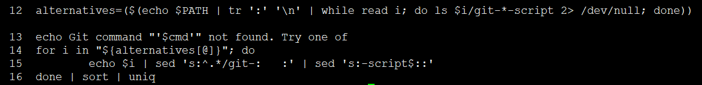

如果找不到对应的指定cmd命令，那么久列出脚本命令给用户选择，让用户挑选一个支持的cmd，相当于help


```
  root@ubuntu16x64:~/github/learn-git/src/gitsrc-v0.99/bin# echo $PATH | tr ':' '\n' | while read i; do ls $i/git-*-script 2> /dev/null; done
  /root/github/learn-git/src/gitsrc-v0.99/bin/git-add-script             /root/github/learn-git/src/gitsrc-v0.99/bin/git-prune-script
  /root/github/learn-git/src/gitsrc-v0.99/bin/git-apply-patch-script     /root/github/learn-git/src/gitsrc-v0.99/bin/git-pull-script
  /root/github/learn-git/src/gitsrc-v0.99/bin/git-checkout-script        /root/github/learn-git/src/gitsrc-v0.99/bin/git-push-script
  /root/github/learn-git/src/gitsrc-v0.99/bin/git-clone-script           /root/github/learn-git/src/gitsrc-v0.99/bin/git-rebase-script
  /root/github/learn-git/src/gitsrc-v0.99/bin/git-commit-script          /root/github/learn-git/src/gitsrc-v0.99/bin/git-relink-script
  /root/github/learn-git/src/gitsrc-v0.99/bin/git-cvsimport-script       /root/github/learn-git/src/gitsrc-v0.99/bin/git-repack-script
  /root/github/learn-git/src/gitsrc-v0.99/bin/git-diff-script            /root/github/learn-git/src/gitsrc-v0.99/bin/git-reset-script
  /root/github/learn-git/src/gitsrc-v0.99/bin/git-fetch-script           /root/github/learn-git/src/gitsrc-v0.99/bin/git-resolve-script
  /root/github/learn-git/src/gitsrc-v0.99/bin/git-format-patch-script    /root/github/learn-git/src/gitsrc-v0.99/bin/git-sh-setup-script
  /root/github/learn-git/src/gitsrc-v0.99/bin/git-log-script             /root/github/learn-git/src/gitsrc-v0.99/bin/git-status-script
  /root/github/learn-git/src/gitsrc-v0.99/bin/git-merge-one-file-script  /root/github/learn-git/src/gitsrc-v0.99/bin/git-tag-script
  ./git-add-script          ./git-commit-script     ./git-format-patch-script    ./git-pull-script    ./git-repack-script    ./git-status-script
  ./git-apply-patch-script  ./git-cvsimport-script  ./git-log-script             ./git-push-script    ./git-reset-script     ./git-tag-script
  ./git-checkout-script     ./git-diff-script       ./git-merge-one-file-script  ./git-rebase-script  ./git-resolve-script
  ./git-clone-script        ./git-fetch-script      ./git-prune-script           ./git-relink-script  ./git-sh-setup-script
```

alternative存放从环境变量中找到的git相关的script脚本，通过模式匹配找到。

```
  root@ubuntu16x64:~/github/learn-git/src/gitsrc-v0.99/bin# git fanfan
  Git command 'fanfan' not found. Try one of
     add
     apply-patch
     checkout
     clone
     commit
     cvsimport
     diff
     fetch
     format-patch
     log
     merge-one-file
     prune
     pull
     push
     rebase
     relink
     repack
     reset
     resolve
     sh-setup
     status
     tag
```

总结一下，git脚本是入口，调用其它脚本，脚本再调用二进制程序，酱紫实现，避免了二进制程序过于复杂，简化二进制程序的入口逻辑。


## 参考

<https://blog.csdn.net/sd2131512/article/details/80995832>
<https://www.cnblogs.com/xingzc/p/5987069.html>
<https://blog.csdn.net/gsyzhu/article/details/38065765>

## END
