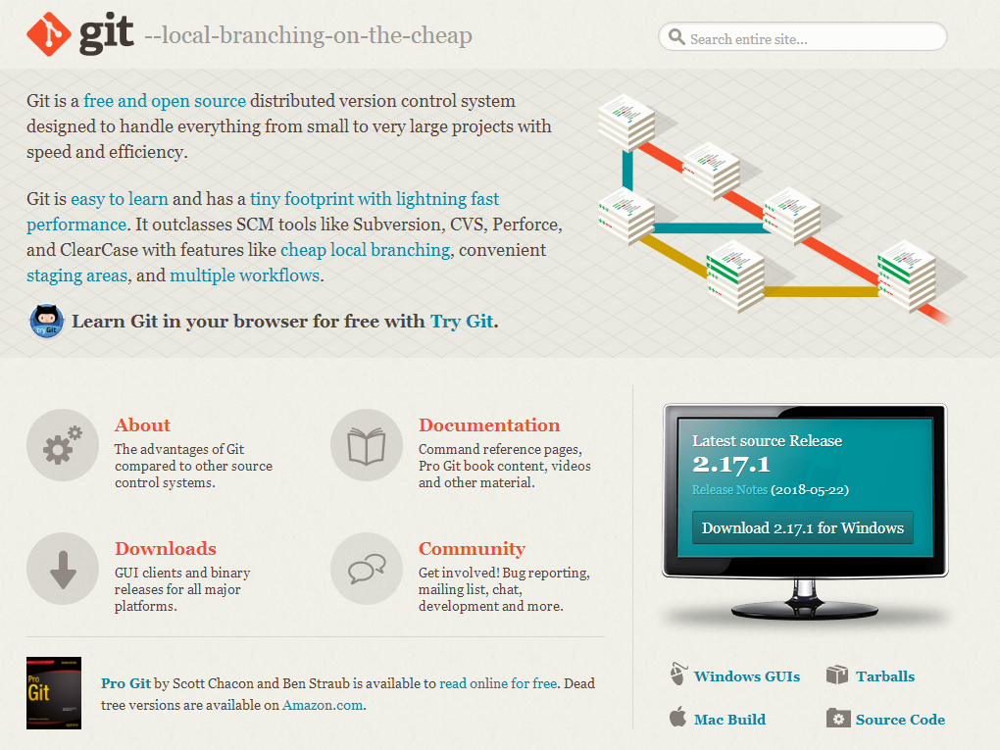
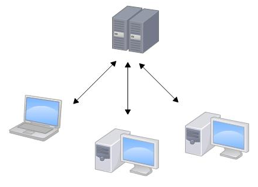
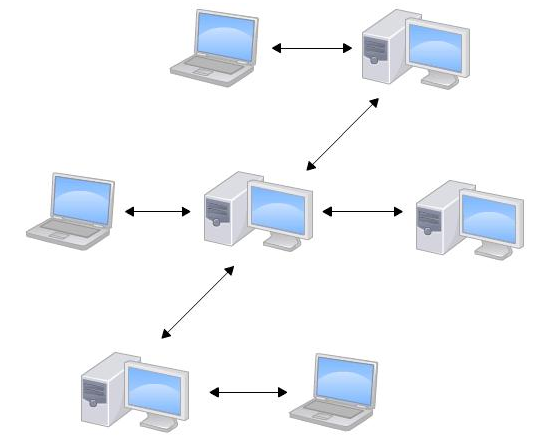
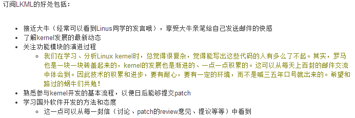

# 第1章-介绍

官网免费提供《Pro Git Book》，已经在本仓库目录中存在pdf版。

## 总结

* Git属于分布式版本控制系统，区别于集中式
* Git英文全称**（Global Information Tracker）全局信息追踪器**

* **集中式版本控制系统**：版本库是集中放在中央服务器的，当我们实际工作的时候，用的都是自己的电脑，所以首先要连接中央服务器，从那里得到最新的版本，然后编写或者更改代码，干完后，需要把自己做完的活推送到中央服务器。集中式版本控制系统是必须联网才能工作，如果在局域网还可以，带宽够大，速度够快，如果在互联网下，如果网速慢的话，就很郁闷了。
* **分布式版本控制系统**：对于搞过大数据(Hadoop)或者大型数据库的朋友，对"分布式"这个概念一定很熟悉了，在此不做过多的解释。与集中式版本控制系统相比，分布式版本控制系统没有中央服务器的。每个人的电脑就是一个完整的版本库，这样，工作的时候就不需要联网了，因为版本都是在自己的电脑上。既然每个人的电脑都有一个完整的版本库。那问题来了，如何进行多个人项目开发协作呢？比如说某人在电脑上修改了文件A，同时其他人也在电脑上改了文件A。这时，你们两之间只需把各自的修改推送给对方，就可以互相看到对方的修改了。
* SVN属于集中式版本控制系统，而Git属于分布式版本控制系统。
* 微软自己也有一个集中式版本控制系统叫**VSS**，集成在Visual Studio中。由于其反人类的设计，连微软自己都不好意思用了。
* Linus一开始使用BitKeeper来管理Linux源代码，但是这个东西从免费搞成了商业，功能多了限制。典型的比如最近TeamViewer的做法也是类似。并且嫌弃BitKeeper的一大波缺点，然后就自立门户开辟了Git。自称其为**“从地狱来的信息管理工具”**。
* 分支的合并是操作做困难和痛苦的事情。
* **需求是创新之母**。
* 最早的VCS是UNIX下的SCCS源代码控制系统。它提供的版本库repository这个概念沿用至今。
* Git发布于2005年4月。2018年，微软75亿美元收购GitHub，全球最大开源代码托管平台。
* Linus在2005年4月20日向Linux内核邮件列表正是宣布，用上Git了~
* **Linux内核邮件列表（Linux kernel mailing list，LKML）**Linux kernel是由分布在世界各地的大牛们共同开发、维护的，这就需要一种交流工具，这种工具就是LKML

* 也许吧，Linux = Linus + MINIX

##
