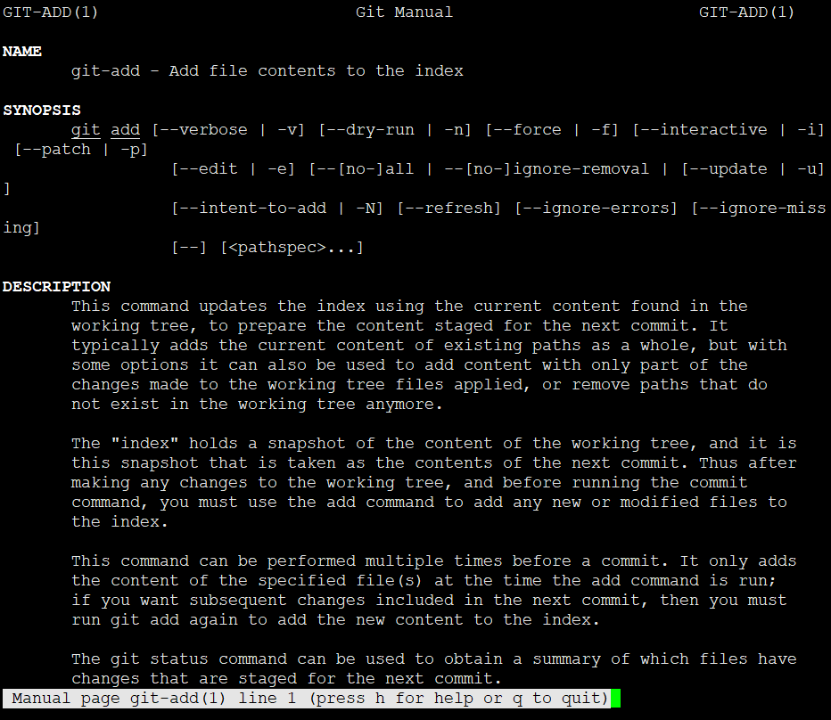
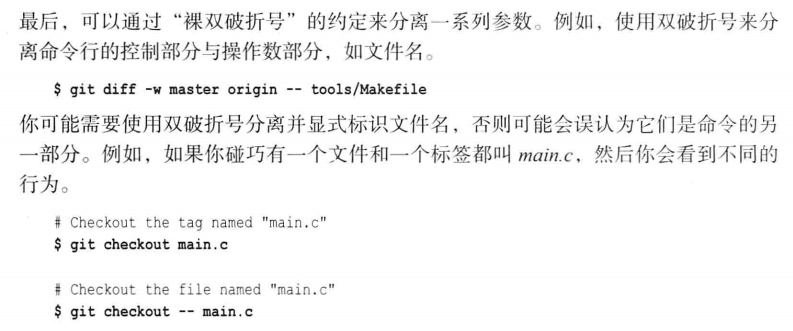

# 第3章-起步

## Git命令行

* 获取帮助信息

```
root@ubuntu16x64:~# git --version
git version 2.7.4

root@ubuntu16x64:~# git help --all
用法：git [--version] [--help] [-C <path>] [-c name=value]
           [--exec-path[=<path>]] [--html-path] [--man-path] [--info-path]
           [-p | --paginate | --no-pager] [--no-replace-objects] [--bare]
           [--git-dir=<path>] [--work-tree=<path>] [--namespace=<name>]
           <command> [<args>]

在 '/usr/lib/git-core' 下可用的 git 命令

  add                       get-tar-commit-id         remote
  add--interactive          grep                      remote-ext
  am                        hash-object               remote-fd
  annotate                  help                      remote-ftp
  apply                     http-backend              remote-ftps
  archive                   http-fetch                remote-http
  bisect                    http-push                 remote-https
  bisect--helper            imap-send                 remote-testsvn
  blame                     index-pack                repack
  branch                    init                      replace
  bundle                    init-db                   request-pull
  cat-file                  instaweb                  rerere
  check-attr                interpret-trailers        reset
  check-ignore              log                       rev-list
  check-mailmap             ls-files                  rev-parse
  check-ref-format          ls-remote                 revert
  checkout                  ls-tree                   rm
  checkout-index            mailinfo                  send-pack
  cherry                    mailsplit                 sh-i18n--envsubst
  cherry-pick               merge                     shell
  clean                     merge-base                shortlog
  clone                     merge-file                show
  column                    merge-index               show-branch
  commit                    merge-octopus             show-index
  commit-tree               merge-one-file            show-ref
  config                    merge-ours                stage
  count-objects             merge-recursive           stash
  credential                merge-resolve             status
  credential-cache          merge-subtree             stripspace
  credential-cache--daemon  merge-tree                submodule
  credential-store          mergetool                 submodule--helper
  daemon                    mktag                     subtree
  describe                  mktree                    symbolic-ref
  diff                      mv                        tag
  diff-files                name-rev                  unpack-file
  diff-index                notes                     unpack-objects
  diff-tree                 pack-objects              update-index
  difftool                  pack-redundant            update-ref
  difftool--helper          pack-refs                 update-server-info
  fast-export               patch-id                  upload-archive
  fast-import               prune                     upload-pack
  fetch                     prune-packed              var
  fetch-pack                pull                      verify-commit
  filter-branch             push                      verify-pack
  fmt-merge-msg             quiltimport               verify-tag
  for-each-ref              read-tree                 web--browse
  format-patch              rebase                    whatchanged
  fsck                      receive-pack              worktree
  fsck-objects              reflog                    write-tree
  gc                        relink

命令 'git help -a' 和 'git help -g' 显示可用的子命令和一些概念帮助。
查看 'git help <命令>' 或 'git help <概念>' 以获取给定子命令或概念的
帮助。
```

* 每个子命令都可以通过以下任意命令形式查看。
  * git help subcommand
  * git --help subcommand
  * git subcommand --help

```
root@ubuntu16x64:~# git --help add
root@ubuntu16x64:~# git help add
root@ubuntu16x64:~# git add --help
```



查询子命令帮助均会跳转到man手册，所以，直接用man手册找也可以。

```
root@ubuntu16x64:~# man git-add
root@ubuntu16x64:~# man git-commit
root@ubuntu16x64:~# man git-push
```
这里连带字符-其实是早期产物，以开水都要这样子命名，后来为了简洁，都采用“”主命令 从命令” 形式

* 一个连字符缩写仅需头字母，两个两字符需要完整命令。这是GNU长选项扩展，约定俗成的规矩。



* 不明白这是啥用~这。。。


##
