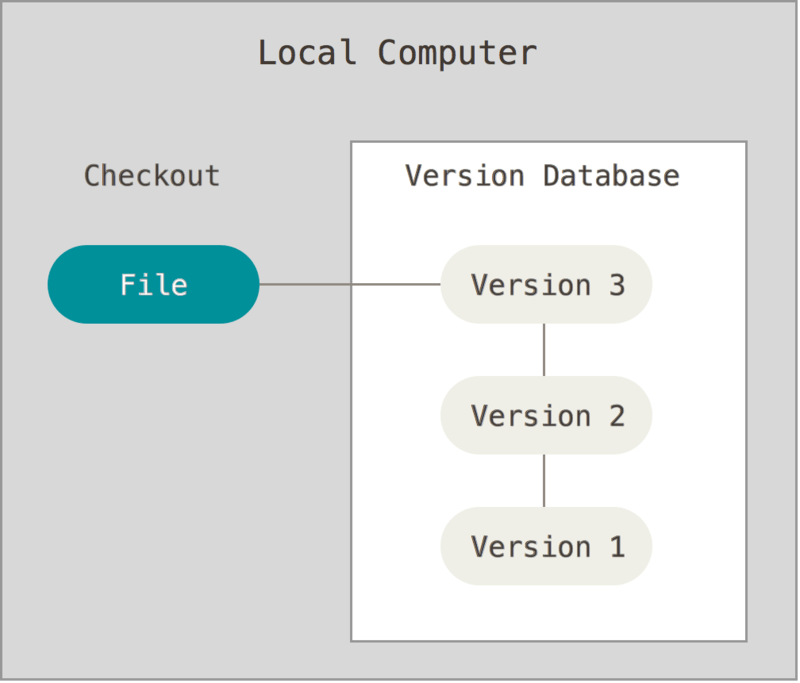
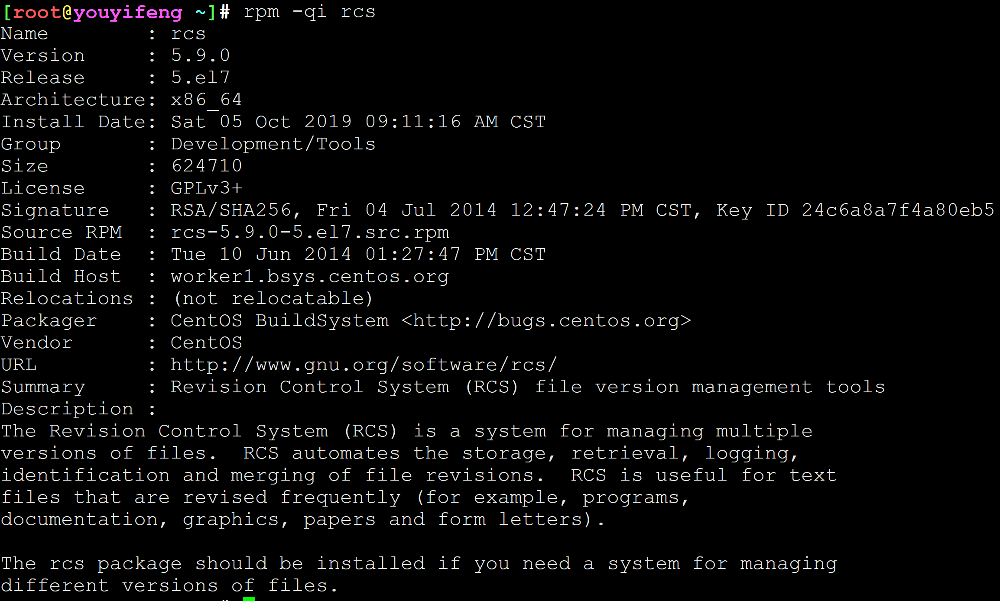
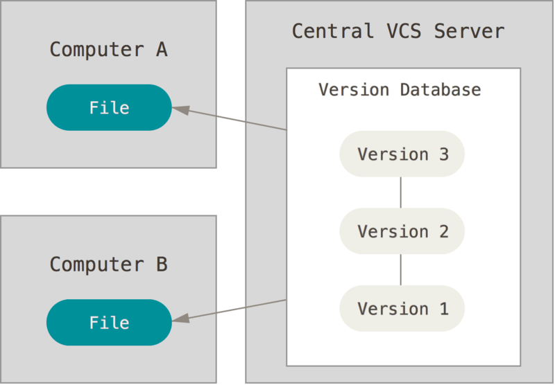
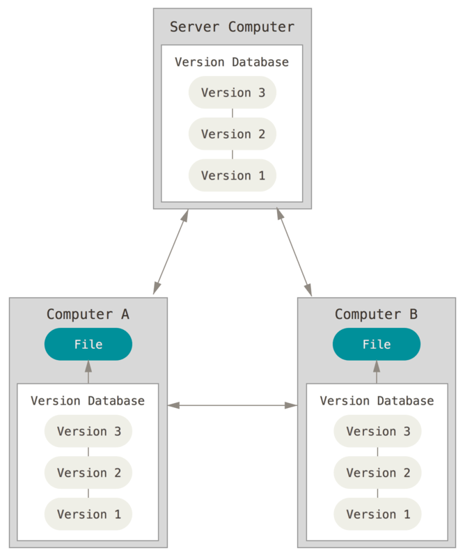

<!-- MDTOC maxdepth:6 firsth1:1 numbering:0 flatten:0 bullets:1 updateOnSave:1 -->

- [关于版本控制](#关于版本控制)   
   - [本地版本控制系统](#本地版本控制系统)   
   - [集中化的版本控制系统](#集中化的版本控制系统)   
   - [分布式版本控制系统](#分布式版本控制系统)   

<!-- /MDTOC -->
# 关于版本控制

什么是“**版本控制（VCS，Version Control System）**”？我为什么要关心它呢？
* 版本控制是一种记录一个或若干文件内容变化，以便将来查阅特定版本修订情况的系统。
* 你可以对任何类型的文件进行版本控制。

如果你是位图形或网页设计师，可能会需要保存某一幅图片或页面布局文件的所有修订版本（这或许是你非常渴望拥有的功能），采用版本控制系统**（VCS，Version Control System）**是个明智的选择。 有了它你就可以**将某个文件回溯到之前的状态**，甚至将整个项目都回退到过去某个时间点的状态，你可以比较文件的变化细节，查出最后是谁修改了哪个地方，从而找出导致怪异问题出现的原因，又是谁在何时报告了某个功能缺陷等等。 使用版本控制系统通常还意味着，就算你乱来一气把整个项目中的文件改的改删的删，你也照样可以轻松恢复到原先的样子。 但额外增加的工作量却微乎其微。

## 本地版本控制系统

**原理：在硬盘上(本地，local computer)保存补丁集(文件修订前后的变化)，通过所有的补丁，可以计算出各个版本的文件内容**

- 许多人习惯用复制整个项目目录的方式来保存不同的版本，或许还会改名加上备份时间以示区别。 这么做唯一的好处就是简单，但是特别容易犯错。
- 有时候会混淆所在的工作目录，一不小心会写错文件或者覆盖意想外的文件。

为了解决这个问题，人们很久以前就开发了许多种本地版本控制系统，大多都是采用某种简单的数据库来记录文件的历次更新差异。



其中最流行的一种叫做 RCS（Revision Control System），现今许多计算机系统上都还看得到它的踪影。 甚至在流行的 Mac OS X 系统上安装了开发者工具包之后，也可以使用```rcs```命令。 它的工作原理是在硬盘上保存补丁集（补丁是指文件修订前后的变化）；通过应用所有的补丁，可以重新计算出各个版本的文件内容。

```
RCS作为非常古老的版本工具，远远在 SVN 和已经退役的 CVS 之前。它的古老程度应该比 Web 开发的 ASP 前代的 CGI 还要久远。但是作为非常简单的文本格式的版本管理工具，它使用时间跨度之久令人惊奇。如果想对版本管理实现方式进行深入研究的话，RCS提供了一种最为简单的方式，v文件是RCS的全部，以文本形式存放，简单易读，对于想深入了解版本管理或者想开发类似工具的开发者来说，绝对是可以借鉴的。
```



RCS（Revision Control System）衍生品有两个 SCCS(Source Code Control System) 和 CVS（Concurrent Versions System）是一种GNU软件包，主要用于在多人开发环境下的源码的维护。现在大多数软件开发公司都使用SVN替代了CVS。

```
RCS -> CVS -> SVC
   `-> SCCS
```

## 集中化的版本控制系统

接下来人们又遇到一个问题，如何让在不同系统上的开发者协同工作？ 于是，**集中化的版本控制系统（CVCS，Centralized Version Control Systems）**应运而生。 这类系统，诸如 CVS、Subversion 以及 Perforce 等，都有一个单一的集中管理的服务器，保存所有文件的修订版本，而协同工作的人们都通过客户端连到这台服务器，取出最新的文件或者提交更新。 多年以来，这已成为版本控制系统的标准做法。



- 这种做法带来了许多好处，特别是相较于老式的本地 VCS 来说。 现在，每个人都可以在一定程度上看到项目中的其他人正在做些什么。
- 而管理员也可以轻松掌控每个开发者的权限，并且管理一个 CVCS 要远比在各个客户端上维护本地数据库来得轻松容易。

- 事分两面，有好有坏。 这么做最显而易见的缺点是中央服务器的单点故障。
- 如果宕机一小时，那么在这一小时内，谁都无法提交更新，也就无法协同工作。
- 如果中心数据库所在的磁盘发生损坏，又没有做恰当备份，毫无疑问你将丢失所有数据——包括项目的整个变更历史，只剩下人们在各自机器上保留的单独快照。
- 本地版本控制系统也存在类似问题，只要整个项目的历史记录被保存在单一位置，就有丢失所有历史更新记录的风险。

## 分布式版本控制系统

于是**分布式版本控制系统（DVCS，Distributed Version Control System）**面世了。 在这类系统中，像 Git、Mercurial、Bazaar 以及 Darcs 等，客户端并不只提取最新版本的文件快照，而是把代码仓库完整地镜像下来。 这么一来，任何一处协同工作用的服务器发生故障，事后都可以用任何一个镜像出来的本地仓库恢复。 因为每一次的克隆操作，实际上都是一次对代码仓库的完整备份。



更进一步，许多这类系统都可以指定和若干不同的远端代码仓库进行交互。籍此，你就可以在同一个项目中，分别和不同工作小组的人相互协作。 你可以根据需要设定不同的协作流程，比如层次模型式的工作流，而这在以前的集中式系统中是无法实现的。
