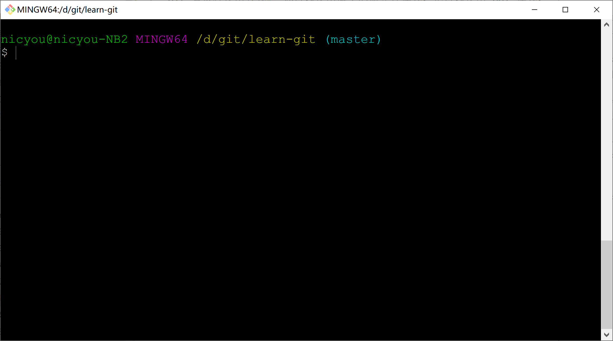
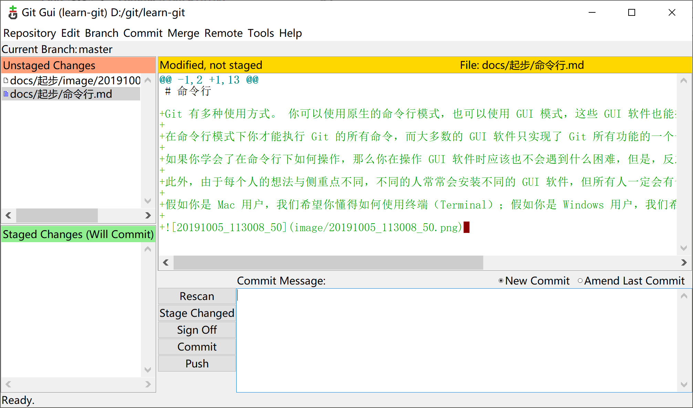

# 命令行

Git 有多种使用方式。 你可以使用原生的命令行模式，也可以使用 GUI 模式，这些 GUI 软件也能提供多种功能。

在命令行模式下你才能执行 Git 的所有命令，而大多数的 GUI 软件只实现了 Git 所有功能的一个子集以降低操作难度。

如果你学会了在命令行下如何操作，那么你在操作 GUI 软件时应该也不会遇到什么困难，但是，反之则不成立。

此外，由于每个人的想法与侧重点不同，不同的人常常会安装不同的 GUI 软件，但所有人一定会有命令行工具。

假如你是 Mac 用户，我们希望你懂得如何使用终端（Terminal）；假如你是 Windows 用户，我们希望你懂得如何使用命令窗口（Command Prompt）或 PowerShell。





使用gitk或者git gui界面，查看更改前后的不同时也会有乱码。
```
git config --global gui.encoding utf-8    
```
应该可以解决图形界面乱码问题
