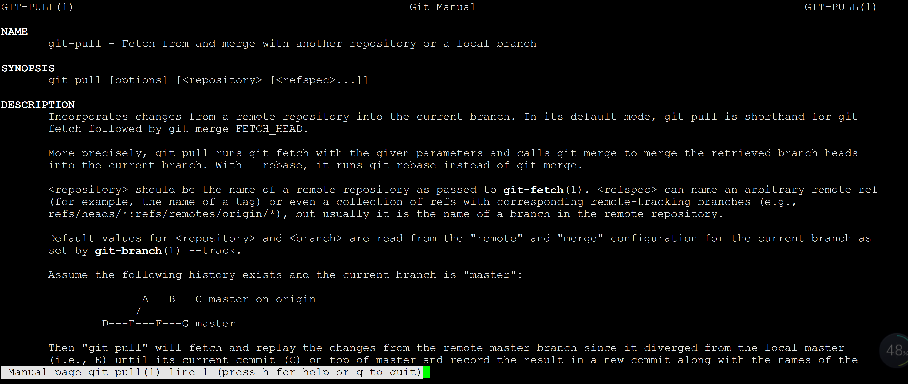
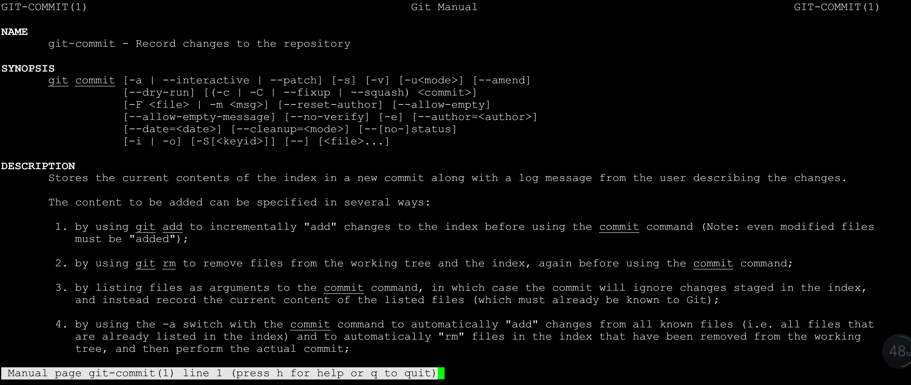

# 获取帮助


若你使用 Git 时需要获取帮助，有三种方法可以找到 Git 命令的使用手册：
```
$ git help <verb>
$ git <verb> --help
$ man git-<verb>
```
例如，要想获得 config 命令的手册，执行
```
$ git help config
```
这些命令很棒，因为你随时随地可以使用而无需联网。 如果你觉得手册或者本书的内容还不够用，你可以尝试在 Freenode IRC 服务器 <http://freenode.net/> （翻墙访问？）的 #git 或 #github 频道寻求帮助。 这些频道经常有上百人在线，他们都精通 Git 并且乐于助人。

 





